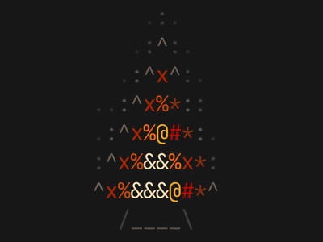

# ember.term

Animated ASCII heat-map scenes for the terminal, rewritten in C for fast standalone rendering.

`ember.term` started as a fork of `ember.nvim`, but it is now a terminal-first application with a native frame engine, an `ncurses` live renderer, and a plain stdout `print-frame` mode for scripts.



## Features

- Standalone binary: `ember-term`
- Three live scenes: `fire`, `lava`, `spiral`
- `widget` mode for small fixed-size panes such as tmux sidebars
- `fullscreen` mode for ambient backgrounds and screensaver-style sessions
- `print-frame` mode for generating a single text frame on stdout
- `default` and `gruvbox` palettes
- Custom glyph ramps with `--chars`
- Built-in `--benchmark` mode for measuring C-side frame cost

## Build

```bash
make
```

The `Makefile` prefers `pkg-config` with `ncursesw` when available and falls back to `-lncurses` on systems like macOS Command Line Tools.

## Usage

```bash
./ember-term --scene fire --palette gruvbox --fps 8 --width 33 --height 12
./ember-term --scene lava --palette gruvbox --fps 6 --fullscreen
./ember-term --scene spiral --chars " .:^*x#%@"
./ember-term --mode print-frame --scene fire --width 33 --height 12
./ember-term --scene spiral --benchmark 180
```

Press `q` or `Ctrl-C` to exit live rendering modes.

## Modes

### Widget

`widget` is the default mode. It renders a fixed-size animation in place and is designed for tmux panes, split terminals, or a compact ambient corner in an existing shell session.

```bash
./ember-term --scene fire --width 33 --height 12
```

### Fullscreen

`fullscreen` fills the current terminal, reacts to terminal resize signals, and keeps running until interrupted.

```bash
./ember-term --scene lava --palette gruvbox --fullscreen
```

### Print Frame

`print-frame` performs one simulation step and writes a single plain-text frame to stdout without ANSI color codes.

```bash
./ember-term --mode print-frame --scene spiral --width 40 --height 16
```

## Options

- `--scene fire|lava|spiral`
- `--palette default|gruvbox`
- `--fps <n>`
- `--width <n>`
- `--height <n>`
- `--chars "<ramp>"`
- `--mode widget|fullscreen|print-frame`
- `--fullscreen`
- `--benchmark [frames]`
- `--help`

## Performance Notes

The main reason for the fork is performance clarity and portability. The runtime uses flat arrays, precomputed neighbor lookups, reusable kernels for `lava` and `spiral`, and row-level dirty tracking for the live renderer. That means the hot loops live in C instead of Lua tables and Neovim API calls.

Example benchmark command:

```bash
./ember-term --scene lava --width 33 --height 12 --benchmark 180
```

## Project Layout

- [src/main.c](/Users/bridgerbrundy/code/ember.term/src/main.c)
- [src/cli.c](/Users/bridgerbrundy/code/ember.term/src/cli.c)
- [src/engine.c](/Users/bridgerbrundy/code/ember.term/src/engine.c)
- [src/live.c](/Users/bridgerbrundy/code/ember.term/src/live.c)
- [Makefile](/Users/bridgerbrundy/code/ember.term/Makefile)

## Notes

The legacy Lua/Neovim files are still present in this initial fork as reference material for scene behavior, but the active runtime is the native C application.
